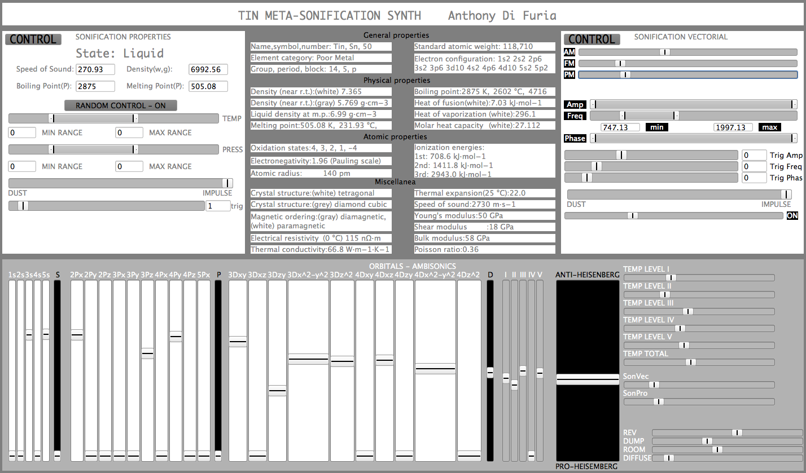
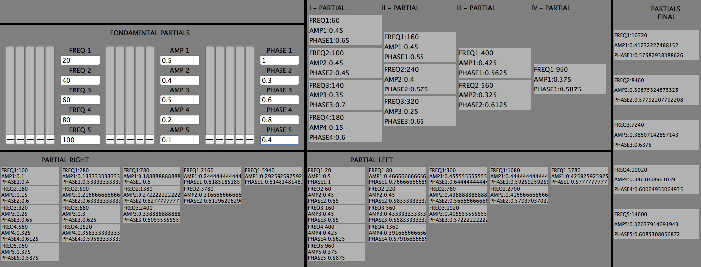
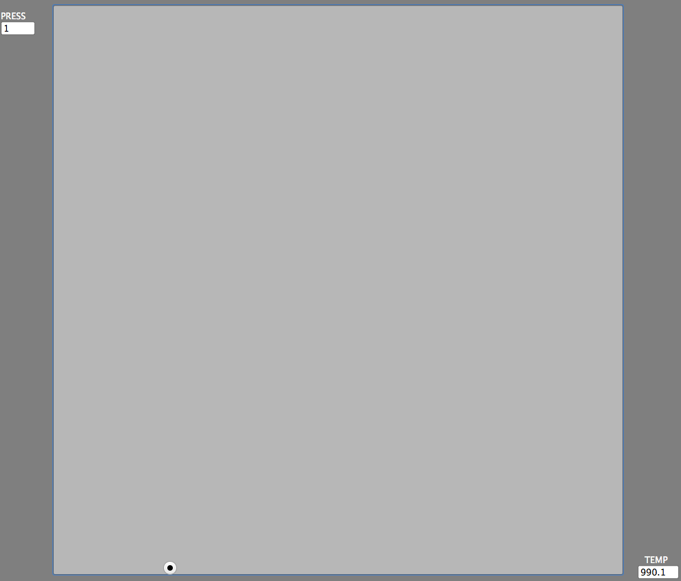
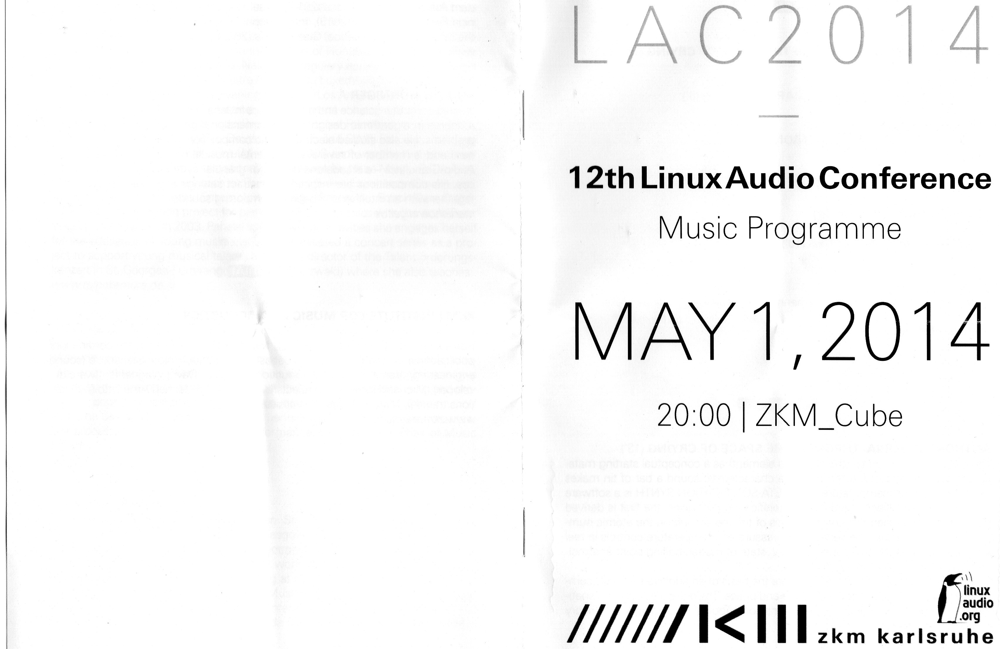
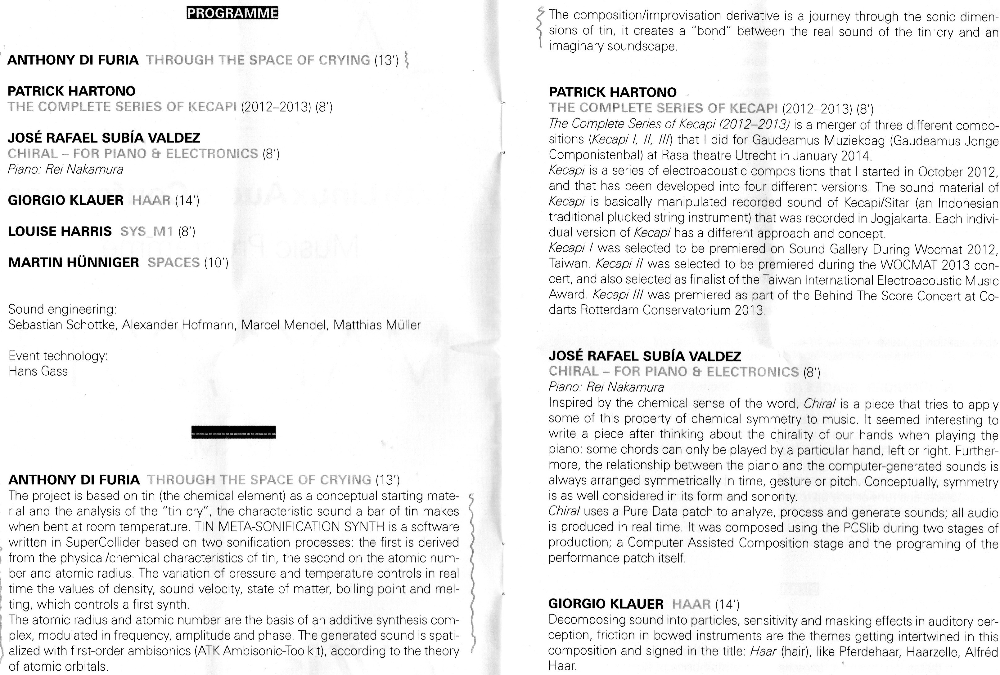

# Tin — Meta-Sonification Synth

A SuperCollider instrument that turns the chemical element **tin (Sn)** into sound: its physical, chemical and atomic properties are mapped onto two synthesis engines and spatialized in ambisonics, producing a real-time, playable sonification of the metal.

The piece grew out of a simple acoustic curiosity — the **"tin cry"**, the crackling sound a bar of pure tin makes when it is bent, caused by the twinning of its crystal structure. The software builds an imaginary counterpart to that real, physical sound.

## Concept

The synth is built on two parallel sonification layers, both derived from tin's own reference data (element Sn, atomic number 50):

- **Physical / chemical layer.** Pressure and temperature controls drive, in real time, values such as density, speed of sound, state of matter (solid / liquid / gas) and the boiling and melting points of tin. These values shape a first synthesis engine.
- **Atomic layer.** The atomic number and atomic radius of tin are the basis of a complex additive ("vectorial") synthesis engine: a bank of partials modulated in frequency, amplitude and phase.

Both engines are spatialized using **first-order ambisonics** (encoded and decoded with the ATK — Ambisonic Toolkit — for SuperCollider) over a periphonic, 8-channel cube layout, with the spatial trajectory of the sound following the geometry of **atomic orbitals**.

The resulting composition/improvisation is a journey through the sonic dimensions of tin, creating a bond between the real sound of the tin cry and this imaginary, synthesized soundscape.

## Repository structure

```
.
├── src/                     SuperCollider source code
│   ├── gui_tin*.scd         Control-panel GUIs for the synth
│   ├── synth_tin*.scd       Synthesis engines and ambisonic encoder/decoder setup
│   └── orbitals*.scd        Orbital-trajectory spatialization patches
├── img/                     Screenshots and documentation images
├── LICENSE                  MIT license
└── README.md
```

## Requirements

- [SuperCollider](https://supercollider.github.io/) (language + server)
- The **ATK (Ambisonic Toolkit) for SuperCollider** quark, for the ambisonic encoder/decoder used by the synthesis and orbital patches
- A multichannel audio interface for full periphonic (8-speaker cube) playback — the patches can also be auditioned by decoding down to stereo/binaural

## Getting started

1. Install SuperCollider and add the ATK-SC3 quark (`Quarks.install("ATK-SC3")` from the SuperCollider IDE, then recompile the class library).
2. Boot the SuperCollider server.
3. Open and evaluate one of the `src/orbitalsN.scd` or `src/synth_tinN.scd` files first — this sets up the ambisonic encoder/decoder matrices, the audio buses and the synth definitions the GUI controls.
4. Open one of the `src/gui_tinN.scd` files and evaluate it to launch the control window.

### The control panel



The main window lays out tin's own reference data (general, physical, atomic and miscellaneous properties) alongside a **Control** section:

- **State / Speed of Sound / Density / Boiling Point / Melting Point** — read-outs of the values currently driving the synth.
- **TEMP** and **PRESS** sliders (each with its own min/max range) — the two real-time controls of the physical/chemical layer; sweeping them moves tin through its states of matter and re-derives density, sound velocity and the other physical values above in real time.
- **DUST / IMPULSE** — percussive, grain-like triggers layered on top of the continuous synthesis.

### The vectorial (additive) synth



The second panel exposes the additive engine derived from tin's atomic number and radius:

- **AM / FM / PM** toggles switch the modulation type applied across the partial bank.
- **Amp / Freq / Phase** sliders (with min/max ranges) and a set of trigonometric modulation sliders shape each partial's amplitude, frequency and phase.
- **DUST / IMPULSE**, as above, add transient/grain material to the additive texture.

### Orbitals and ambisonics

At the bottom of the main window, the **ORBITALS — AMBISONICS** strip lets individual electron-shell channels (S, P, D) feed energy into the spatialization stage: the sound is encoded to first-order ambisonics and decoded periphonically over the 8-channel cube, following the geometry of the corresponding atomic orbital. **REV / DUMP / ROOM / DIFFUSE** shape the character of that spatial diffusion, and the small monitor window below tracks the running temperature/pressure state used to fire transient events.



## Premiere

This project was realized as *Through the Space of Crying* and premiered in the Music Programme of the **12th Linux Audio Conference (LAC 2014)**, held at the ZKM_Cube, Karlsruhe, on May 1, 2014.

From the official concert programme:

> "The project is based on tin (the chemical element) as a conceptual starting material and the analysis of the "tin cry", the characteristic sound a bar of tin makes when bent at room temperature. [...] The atomic number and atomic radius are the basis of an additive synthesis complex, modulated in frequency, amplitude and phase. The generated sound is spatialized with first-order ambisonics (ATK Ambisonic-Toolkit), according to the theory of atomic orbitals."
>
> "The composition/improvisation derivative is a journey through the sonic dimensions of tin, it creates a 'bond' between the real sound of the tin cry and an imaginary soundscape."




## License

Released under the [MIT License](LICENSE).
